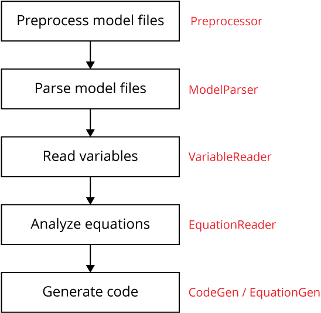
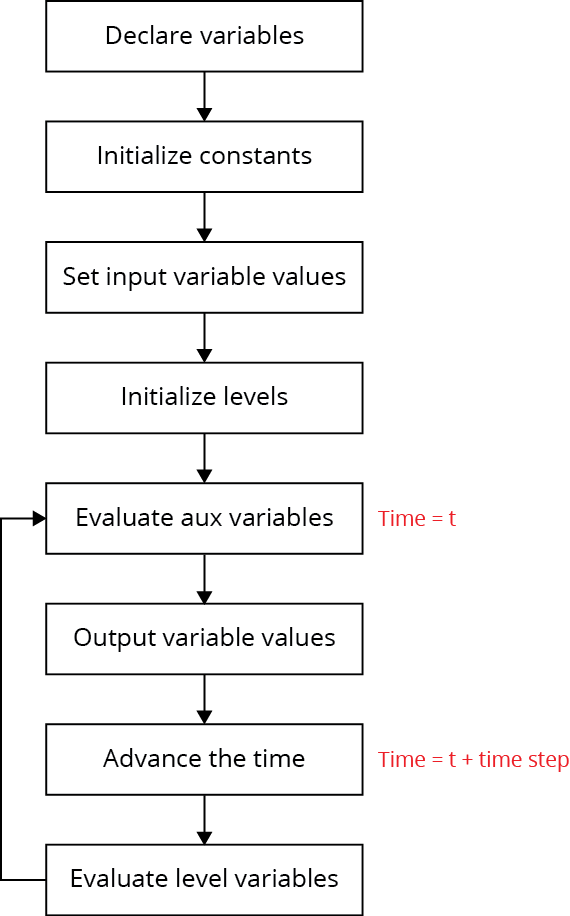
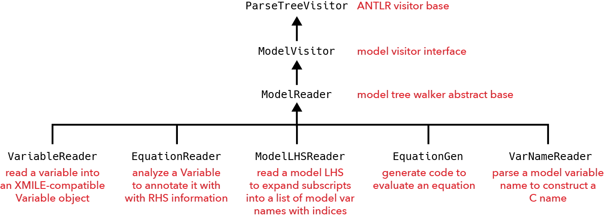

# SDEverywhere &nbsp;&nbsp; 

## Introduction

TODO: suite/collection of libraries and command line tools to transform System Dynamics models for ...

TODO:

- Vensim to C (and WebAssembly/JavaScript)
- web user interface
- model check/comparison

[SDEverywhere](http://sdeverywhere.org/) is a [Vensim](http://vensim.com/) [transpiler](https://en.wikipedia.org/wiki/Source-to-source_compiler) that handles a broad range of [System Dynamics](http://www.systemdynamics.org/what-is-system-dynamics/) models. It supports some advanced features of the [Vensim modeling language](https://www.vensim.com/documentation/index.html?ref_language.htm), including subscripts, subranges, and subscript mapping. It generates C and JavaScript code, and can create a generic web user interface for simple models.

Using SDEverywhere, you can deploy interactive System Dynamics models in mobile, desktop, and web apps for policymakers and the public. Or you could perform model analysis using general-purpose languages, running the model as high-performance C code.

## Quick start

TODO: Requirements

TODO: Install [Node.js](https://nodejs.org/) version 14 or later. This will also install the `npm` Node Package Manager.

TODO: `npm create @sdeverywhere`

## Documentation

TODO: Link to wiki and table of packages

## Use in production

- [Climate Interactive](https://www.climateinteractive.org) has been using SDEverywhere in production since 2019 for their popular simulation tools:
  - [En-ROADS](https://en-roads.climateinteractive.org) &mdash; an online global climate simulator that allows users to explore the impact of policies on hundreds of factors like energy prices, temperature, air quality, and sea level rise
  - [C-ROADS](https://c-roads.climateinteractive.org) &mdash; an online policy simulator (also available as a macOS or Windows desktop application) that helps people understand the long-term climate impacts of national and regional greenhouse gas emission reductions at the global level

## Caveats

SDEverywhere has been used to generate code for complex models with thousands of equations, but your model may use features of Vensim that SDEverywhere cannot translate yet. Please fork our code and contribute! Here are some prominent current limitations.

- Sketch information, the visual representation of the model, is not converted.
- Only the most common [Vensim functions](https://www.vensim.com/documentation/index.html?20770.htm) are implemented.
- All models run using the Euler integrator.
- Strings are not supported.
- You must rewrite tabbed arrays as separate, non-apply-to-all variables.
- You must rewrite equations that use macros or code them in C.

Tabbed arrays and macros are removed from the model during preprocessing and written to the `removals.txt` file for your reference.

## Repository structure

SDEverywhere is developed in a monorepo structure.
Each package listed in the table below is developed as a separate npm package/library under the `packages` directory in this repository.
All packages are published independently to the [npm registry](https://www.npmjs.com).

If you're new to SDEverywhere, refer to the [Quick start](#quick-start) section above.
Running the `npm create @sdeverywhere` command described in that section will take care of setting up a recommended project structure and will install/configure the necessary `@sdeverywhere` packages from the table below.

If you want more control over which packages are installed, or for API documentation and configuration instructions, refer to the links below.

Packages marked with an asterisk (\*) are implementation details
Most users won't need to interact with these implementation packages directly, but they may be useful for advanced use cases (for example, if you want to build a custom test runner).

<table>
  <tr>
    <th>Package</th>
    <th>Version</th>
    <th>Links</th>
  </tr>
  <tr>
    <td colspan="3"><em>Project creation</em></td>
  </tr>
  <tr>
    <td><a href="./packages/create">@sdeverywhere/create</a></td>
    <td><a href="https://www.npmjs.com/package/@sdeverywhere/create"></a></td>
    <td>
      <a href="./packages/create">Source</a>&nbsp;|&nbsp;
      <a href="./packages/create/README.md">Docs</a>&nbsp;|&nbsp;
      <a href="./packages/create/CHANGELOG.md">Changelog</a>
    </td>
  </tr>
  <tr>
    <td colspan="3"><em>Command line interface</em></td>
  </tr>
  <tr>
    <td><a href="./packages/cli">@sdeverywhere/cli</a></td>
    <td><a href="https://www.npmjs.com/package/@sdeverywhere/cli"></a></td>
    <td>
      <a href="./packages/cli">Source</a>&nbsp;|&nbsp;
      <a href="./packages/cli/README.md">Docs</a>&nbsp;|&nbsp;
      <a href="./packages/cli/CHANGELOG.md">Changelog</a>
    </td>
  </tr>
  <tr>
    <td colspan="3"><em>Build plugins</em></td>
  </tr>
  <tr>
    <td><a href="./packages/plugin-config">@sdeverywhere/plugin-config</a></td>
    <td><a href="https://www.npmjs.com/package/@sdeverywhere/plugin-config"></a></td>
    <td>
      <a href="./packages/plugin-config">Source</a>&nbsp;|&nbsp;
      <a href="./packages/plugin-config/README.md">Docs</a>&nbsp;|&nbsp;
      <a href="./packages/plugin-config/CHANGELOG.md">Changelog</a>
    </td>
  </tr>
  <tr>
    <td><a href="./packages/plugin-wasm">@sdeverywhere/plugin-wasm</a></td>
    <td><a href="https://www.npmjs.com/package/@sdeverywhere/plugin-wasm"></a></td>
    <td>
      <a href="./packages/plugin-wasm">Source</a>&nbsp;|&nbsp;
      <a href="./packages/plugin-wasm/README.md">Docs</a>&nbsp;|&nbsp;
      <a href="./packages/plugin-wasm/CHANGELOG.md">Changelog</a>
    </td>
  </tr>
  <tr>
    <td><a href="./packages/plugin-worker">@sdeverywhere/plugin-worker</a></td>
    <td><a href="https://www.npmjs.com/package/@sdeverywhere/plugin-worker"></a></td>
    <td>
      <a href="./packages/plugin-worker">Source</a>&nbsp;|&nbsp;
      <a href="./packages/plugin-worker/README.md">Docs</a>&nbsp;|&nbsp;
      <a href="./packages/plugin-worker/CHANGELOG.md">Changelog</a>
    </td>
  </tr>
  <tr>
    <td><a href="./packages/plugin-vite">@sdeverywhere/plugin-vite</a></td>
    <td><a href="https://www.npmjs.com/package/@sdeverywhere/plugin-vite"></a></td>
    <td>
      <a href="./packages/plugin-vite">Source</a>&nbsp;|&nbsp;
      <a href="./packages/plugin-vite/README.md">Docs</a>&nbsp;|&nbsp;
      <a href="./packages/plugin-vite/CHANGELOG.md">Changelog</a>
    </td>
  </tr>
  <tr>
    <td><a href="./packages/plugin-check">@sdeverywhere/plugin-check</a></td>
    <td><a href="https://www.npmjs.com/package/@sdeverywhere/plugin-check"></a></td>
    <td>
      <a href="./packages/plugin-check">Source</a>&nbsp;|&nbsp;
      <a href="./packages/plugin-check/README.md">Docs</a>&nbsp;|&nbsp;
      <a href="./packages/plugin-check/CHANGELOG.md">Changelog</a>
    </td>
  </tr>
  <tr>
    <td colspan="3"><em>Runtime libraries</em></td>
  </tr>
  <tr>
    <td><a href="./packages/runtime">@sdeverywhere/runtime</a></td>
    <td><a href="https://www.npmjs.com/package/@sdeverywhere/runtime"></a></td>
    <td>
      <a href="./packages/runtime">Source</a>&nbsp;|&nbsp;
      <a href="./packages/runtime/README.md">Docs</a>&nbsp;|&nbsp;
      <a href="./packages/runtime/CHANGELOG.md">Changelog</a>
    </td>
  </tr>
  <tr>
    <td><a href="./packages/runtime-async">@sdeverywhere/runtime-async</a></td>
    <td><a href="https://www.npmjs.com/package/@sdeverywhere/runtime-async"></a></td>
    <td>
      <a href="./packages/runtime-async">Source</a>&nbsp;|&nbsp;
      <a href="./packages/runtime-async/README.md">Docs</a>&nbsp;|&nbsp;
      <a href="./packages/runtime-async/CHANGELOG.md">Changelog</a>
    </td>
  </tr>
  <tr>
    <td colspan="3"><em>Build/CLI implementation</em></td>
  </tr>
  <tr>
    <td><a href="./packages/build">@sdeverywhere/build</a> *</td>
    <td><a href="https://www.npmjs.com/package/@sdeverywhere/build"></a></td>
    <td>
      <a href="./packages/build">Source</a>&nbsp;|&nbsp;
      <a href="./packages/build/README.md">Docs</a>&nbsp;|&nbsp;
      <a href="./packages/build/CHANGELOG.md">Changelog</a>
    </td>
  </tr>
  <tr>
    <td><a href="./packages/compile">@sdeverywhere/compile</a> *</td>
    <td><a href="https://www.npmjs.com/package/@sdeverywhere/compile"></a></td>
    <td>
      <a href="./packages/compile">Source</a>&nbsp;|&nbsp;
      <a href="./packages/compile/README.md">Docs</a>&nbsp;|&nbsp;
      <a href="./packages/compile/CHANGELOG.md">Changelog</a>
    </td>
  </tr>
  <tr>
    <td colspan="3"><em>`model-check` implementation</em></td>
  </tr>
  <tr>
    <td><a href="./packages/check-core">@sdeverywhere/check-core</a> *</td>
    <td><a href="https://www.npmjs.com/package/@sdeverywhere/check-core"></a></td>
    <td>
      <a href="./packages/check-core">Source</a>&nbsp;|&nbsp;
      <a href="./packages/check-core/README.md">Docs</a>&nbsp;|&nbsp;
      <a href="./packages/check-core/CHANGELOG.md">Changelog</a>
    </td>
  </tr>
  <tr>
    <td><a href="./packages/check-ui-shell">@sdeverywhere/check-ui-shell</a> *</td>
    <td><a href="https://www.npmjs.com/package/@sdeverywhere/check-ui-shell"></a></td>
    <td>
      <a href="./packages/check-ui-shell">Source</a>&nbsp;|&nbsp;
      <a href="./packages/check-ui-shell/README.md">Docs</a>&nbsp;|&nbsp;
      <a href="./packages/check-ui-shell/CHANGELOG.md">Changelog</a>
    </td>
  </tr>
</table>

## Features

TODO: Using `create`

TODO: Using config files

TODO: model-check

## Contributing

SDEverywhere covers a subset of the Vensim modeling language used in models that have been deployed with it. There is still much to contribute.

- Expand the Vensim parser to cover more of the language syntax, such as documentation strings, `:EXCEPT:` clauses, etc.
- Enhance the C code generator to produce code for new language features now that you can parse them.
- Implement more Vensim functions. This is the easiest way to help out.
- Target languages other than C, such as R or Ruby. (If you want Python, check out the excellent [PySD](https://github.com/JamesPHoughton/pysd)).

## License

All packages developed in the SDEverywhere repository are distributed under the MIT license.
See [LICENSE](./LICENSE) for more details.

## Conventions used in this guide

A string surrounded by curly braces `{like this}` indicates a placeholder that you should fill in with the appropriate value.

## Installing

### Requirements

Using SDEverywhere requires the macOS operating system and the free [Xcode](https://itunes.apple.com/us/app/xcode/id497799835) development tools from Apple.

### Install Node.js

Install [Node.js](https://nodejs.org/) version 14 or later. This will also install the `npm` Node Package Manager.

### Install SDEverywhere

If you want to use the stable release of SDEverywhere, simply install the npm package. If you want to work with the latest version of SDEverywhere in development, install source code from GitHub (see below).

**Install the stable release version of SDEverywhere**

```
npm install @sdeverywhere/cli -g
```

**Install the development version of SDEverywhere**

If you previously installed the SDEverywhere package using npm, uninstall that package first before installing your new, local copy.

```
npm rm @sdeverywhere/cli -g
```

Clone the `SDEverywhere` and `antlr4-vensim` repos in a project directory of your choice using either `git` on the command line or Sourcetree (see below).

_If you are using command-line Git_, clone each repo and track the `develop` branch, substituting your project directory name for "{project directory}".

```
cd {project directory}
git clone https://github.com/climateinteractive/antlr4-vensim
cd antlr4-vensim
cd ..
git clone https://github.com/climateinteractive/SDEverywhere
cd SDEverywhere
```

_If you are using Sourcetree_, do File > New > Clone from URL. Fill in the form as follows, substituting your project directory name for "{project directory}".

| Prompt           | Contents                                                |
| ---------------- | ------------------------------------------------------- |
| Source URL       | https://github.com/climateinteractive/antlr4-vensim.git |
| Destination Path | {project directory}/antlr4-vensim                       |
| Name             | antlr4-vensim                                           |

Then do the same for SDEverywhere.

| Prompt           | Contents                                               |
| ---------------- | ------------------------------------------------------ |
| Source URL       | https://github.com/climateinteractive/SDEverywhere.git |
| Destination Path | {project directory}/SDEverywhere                       |
| Name             | SDEverywhere                                           |

Track the `main` branch for both repos in Sourcetree by opening "origin" under Remotes in the sidebar, and then double-clicking `main`. Click the Checkout button.

When running SDEverywhere in development, you can also link the local version of `antlr4-vensim` by adding the following to `package.json`:

```
{
  "pnpm": {
    "overrides": {
      "antlr4-vensim": "link:../antlr4-vensim"
    }
  }
}
```

Then run `pnpm install`.

If you need to run SDEverywhere in a debugger, use the instructions in the "Debugging" section below.

## Test your setup

If you cloned the GitHub repo, you can test your installation by building and running the models in the `models` directory, and then comparing SDEverywhere output to Vensim output. Each model has its own directory under `models` with the same name as the model.

Run all model tests with pnpm.

```
pnpm test
```

## Usage

Use `sde -h` to see a list of all commands.

Use `sde {command}` to see options for a command.

It is usually easiest to run these commands from the directory where the `.mdl` file is located. The `{model}` placeholder can be the model filename, for instance `arrays.mdl`, or simply the model name `arrays`.

If you are not running from the model directory, you can give a full pathname to locate the `.mdl` file anywhere on the system.

By default, SDEverywhere will create a `build` directory in your model directory to hold the generated code and the compiled model. If you run the model, it will also create an `output` directory by default. You can specify other directories with command options.

**Generate baseline model code that outputs all variables with no inputs**

```
sde generate --genc {model}
```

**List a model's variables**

```
sde generate --list {model}   ## list will be `build` directory
```

**Preprocess a model to remove macros and tabbed arrays to removals.txt**

```
sde generate --preprocess {model}  ## model will be `build` directory
```

**Compile the C code into an executable in the build directory**

```
sde compile {model}
```

**Run the executable and capture output into a text file in the output directory**

```
sde exec {model} {arguments}
```

**Convert the SDEverywhere output file to a DAT file in the output directory**

```
sde log --dat output/{model}.txt
```

**Compare a previously exported Vensim DAT file to SDEverywhere output**

```
sde compare {model}.dat output/{model}.dat
```

**Generate C code and compile it in the build directory**

```
sde build {model}
```

**Build C code and run the model**

```
sde run {model}
```

**Run the model and compare its output to a previously exported Vensim DAT file**

```
sde test {model}
```

**Delete the build, output, and html directories**

```
sde clean {model}
```

**Print variable dependencies**

```
sde causes {model} {C variable name}
```

**Convert variable names to C format**

```
sde names {model} {Vensim names file}
```

**Print the SDEverywhere home directory**

```
sde which
```

### Specify input and output variables

Most applications do not require all variables in the output. And we usually want to designate some constant variables as inputs. In SDEverywhere, this is done with a model specification JSON file. The conventional name is `{model}_spec.json`.

First, create a model specification file that gives the Vensim names of input and output variables of interest. Be sure to include `Time` first among the output variables.

```JSON
{
  "inputVars": [
    "Reference predators",
    "Reference prey"
  ],
  "outputVars": [
    "Time",
    "Predators Y",
    "Prey X"
  ]
}
```

### Specify external data sources

Add a `directData` section to the spec file to have SDEverywhere read data from an Excel file into lookups with a variable name prefix. There is an example in the `directdata` sample model.

```JSON
"directData": {
  "?data": "data.xlsx"
}
```

### Specify equations to remove from the model

When SDEverywhere cannot handle a certain Vensim construct yet, you will need to remove equations that use the construct from the model, convert it by hand into something that SDEverywhere can handle, and then insert it back into the model. To have the preprocessor remove equations from the model into a `removals.txt` file, specify substrings to match in the equation in the `removalKeys` section. Macros and TABBED ARRAY equations are already automatically removed by the preprocessor.

For instance, you could key on the variable name in the equation definition.

```JSON
"removalKeys": [
  "varname1 =",
  "varname2 ="
]
```

### Generating, compiling, running, and testing the C code

To generate C code using the `--spec` argument, enter the following command:

```
sde generate --genc --spec {model}_spec.json {model}
```

SDE allows for validation against Vensim output. Before running the C file, it is useful to generate the Vensim data so you can ensure the C code is valid and reproduces the same results as Vensim. To make the Vensim output, run the model in 64-bit Vensim and export the run in DAT format to the `{model}.dat` file in the model directory.

The `sde test` command generates baseline C code that outputs all variables with no inputs. It then compiles the C code and runs it. The output is captured and converted into DAT format in the `output/{model}.dat` file. This is compared to Vensim run exported to a `{model}.dat` file in the model directory. All values that differ by a factor of 1e-5 or more are listed with the variance.

```
sde test {model}
```

### Setting inputs

SDEverywhere generates code that runs the model using the constants defined in the model. To explore model behavior, the user changes the values of constants we call "input variables" and runs the model again.

There is a `setInputs` implementation in the generated code that gets called at initialization. It takes a string with serialized input values and sets variable values from it. The serialization format depends on the needs of your application. You can replace `setInputs` if you want to use a different serialization form. The input variables are listed in the `inputVars` section of the spec file. Look at the `arrays` model for an example.

The generated format minimizes the amount of data on the wire for web applications. It parses index-value pairs sent in a compact format that looks like this: `0:3.14 6:42`. That is, the values are separated by spaces, and each pair has an index number, a colon, and a floating point number.

The zero-based index maps into a static array of input variable pointers held in the function. These are used to set the value directly into the static `double` variable in the generated code.

### Inserting a file into the model

Some constructs like macros are not supported by SDEverywhere. They are removed from the model by the preprocessor into the `removals.txt` file. You can edit these constructs into a form that SDEverywhere supports and insert them back into the model. Simply create a file called `mdl-edits.txt` in the model directory with the constructs to insert. For instance, manually expand macros and place them into the `mdl-edits.txt` file. The preprocessor will read this file and insert its contents unchanged into the beginning of the model.

## Generating a web application

Refer to the "Using SDEverywhere to Make a Vensim Model into a Web Application" article in the `notes` directory for full details on designing and building your web app.

### Debugging

If you are using Atom, you can run the Chrome debugger inside Atom using the [Atom IDE](https://ide.atom.io/).

To run in the Chrome debugger, start Node with the `--inspect-brk` flag. Use `node main.js` from the `packages/cli/src` directory.

[Debugging Node.js with Chrome DevTools](https://medium.com/@paul_irish/debugging-node-js-nightlies-with-chrome-devtools-7c4a1b95ae27)

Place a `debugger` statement in the code to set a breakpoint. Only one source file is available when the debugger starts. Others will become available as you step through code or examine the call stack. You can set additional breakpoints in the debugger once the source file is loaded.

When running in the Chrome debugger, enter `ctx.getText()` in the console when in a visitor method to see the text of the parser node.

An exception of "code generator exception: Cannot read property 'name' of undefined" is generated when a subscript is not able to be resolved by the `subs()` function in `normalizeSubscripts()`.

To print a stack trace to the console, use `console.error(e.stack)` in an exception handler and `console.trace()` elsewhere.

In the C input parsing code, show a changed value:

```C
if (*inputVarPtrs[modelVarIndex] != value) {
  fprintf(stderr, "input %d changed from %g to %g\n", modelVarIndex, *inputVarPtrs[modelVarIndex], value);
}
```

## SDEverywhere architecture

SDEverywhere is a transpiler that converts models written in the [Vensim modeling language](http://www.vensim.com/documentation/index.html?22300.htm) to either C or JavaScript. The language features and Vensim library functions that are most commonly used in models are supported, including subscripts.

SDEverywhere is written in the [ECMAScript 2015](https://github.com/lukehoban/es6features) language (also known as ES6), a modern, standardized version of JavaScript. Much of the code is written in a functional programming style using the [Ramda](http://ramdajs.com/) toolkit.

### Some notes on terminology

SDEverywhere uses [XMILE](http://docs.oasis-open.org/xmile/) terminology in most cases. A Vensim subscript range becomes a "dimension" that has "indices". (The XMILE specification has "element" as the child of "dimension" in the model XML format, but uses "index" informally, so SDEverywhere sticks with "index".) XMILE does not include the notion of subranges. SDEverywhere calls subranges "subdimensions".

Vensim refers to variables and equations interchangeably. This usually makes sense, since most variables are defined by a single equation. In SDEverywhere, models define variables with equations. However, a subscripted variable may be defined by multiple equations. In XMILE terminology, an _apply-to-all_ array has an equation that defines all indices of the variable. There is just one array variable. A _non-apply-to-all_ array is defined by different equations for each index. This means there are multiple variables, one for each index.

The `Variable` class is the heart of SDEverywhere. An equation has a left-hand side (LHS), usually the variable name, and a right-hand side (RHS), usually a formula expression that is evaluated to determine the variable's value. The RHS could also be a Vensim lookup (a set of data points) or a constant array.

### Parsing

The `sde generate` command reads the model file, an optional model spec JSON file detailing input and output variables, and an optional subscript JSON file detailing dimensions, indices, and mappings. Each file is parsed and then handed off to the `CodeGen` object.

The model file is parsed using a grammar generated by [ANTLR 4](http://www.antlr.org/). The parser constructs a parse tree that the code generator works with. The model file is passed through a preprocessor first to handle some things the grammar can't work with yet, such as macros and tabbed arrays. See the [antlr4-vensim](https://github.com/climateinteractive/antlr4-vensim) package for more on the parser.

### Code generation overview

The `antlr4-vensim` Vensim parser requires the model to be preprocessed to remove certain constructs such as macros and tabbed arrays that it can't parse yet. The `Preprocessor` module removes them into a file named `removals.txt`. Then the `ModelParser` class generated by ANTLR 4 parses the model.

SDEverywhere visits the parse tree with the `VariableReader` class to construct `Variable` objects that contain basic information about each variable.

A second pass through the parse tree with the `EquationReader` class analyzes the right-hand side (RHS) of each equation to further annotate the `Variable` objects. The variable type is determined, and the variables the equation references are listed.

SDEverywhere is now ready to generate code with the `CodeGen` module and `EquationGen` class.



### The generated model and the run loop

Each section of a complete model program in C is written in sequence. The decl section declares C variables, including arrays of the proper size. The init section initializes constant variables and evaluates levels and the auxiliary variables necessary to evaluate them. The eval section is the main run loop. It evaluates aux variables and then outputs the state. The time is advanced to the next time step. Levels are evaluated next, and then the loop is finished. The input/output section has the code that sends output variable values to the output channel and optionally sets input values when the program starts.



### The Variable object

The `eqnCtx` property holds a reference to the ANTLR `ParserRuleContext` object for the variable in the parse tree. This enables the code generator to walk the subtree for the variable.

In the `Variable` object, the `modelLHS` and `modelFormula` properties preserve the Vensim variable name (left-hand side of the equation) and the Vensim formula (RHS). Everywhere else, names of variables are in a canonical format compatible with the C programming language. The Vensim name is converted to lower case (it is case insensitive), spaces are replaced with underscores, and an underscore is prepended to the name. Vensim function names are similar, but are upper-cased instead.

The unsubscripted form of the Vensim variable name, in canonical format, is saved in the `varName` property. If there are subscripts in the LHS, the maximal canonical dimension names in sorted "normal" order establish subscript families by position in the `families` property. The subscripts are saved as canonical dimension or index names in the LHS in normal order in the `subscripts` property.

Lookup variables do not have a formula. Instead, they have a list of 2-D points and an optional range. These are saved in the `points` and `range` properties.

Each variable has a `refId` property that gives the variable's LHS in a normal form that can be used in lists of references. The `refId` is the same as the `varName` for unsubscripted variables. A subscripted variable can include both dimension and index subscripts on the LHS. When another variable refers to the subscripted variable, we add its `refId` to the list of references. The normal form for a `refId` has the canonical name of each dimension or index sorted by their subscript families, separated by commas in a single pair of brackets, for example: `_a[_dima,_dimb]`.

The `references` array property lists the refIds of variables that this variable's formula references. This determines the dependency order and thus evaluation order during code generation. Some Vensim functions such as `_INTEG` have a special initialization argument that is evaluated before the normal run loop. The references in the expression for this argument are stored in the `initReferences` property and do not appear in `references` unless they occur elsewhere in the formula.

The `varType` property holds the variable type, which determines where the variable is evaluated in the sim’s run loop. The [Vensim variable types](https://www.vensim.com/documentation/ref_variable_types.htm) that SDEverywhere supports are constant, auxiliary, level, lookup, initial, and data.

Lookups may occur as function arguments as well as variables in their own right. When this happens, the code generator generates an internal lookup variable to hold the lookup's points. The name of the generated variable is saved in the `lookupArgVarName` property. It replaces the lookup as the function argument when code is generated.

`SMOOTH*` calls are replaced by a generated level variable named in `smoothVarName`. `DELAY3*` calls are replaced by a level named in `delayVarName` and an aux variable named in `delayTimeVarName`.

### Visitor classes

In SDEverywhere, most of the work is accomplished by visitor classes that walk the parse tree.



`ParseTreeVisitor` is the visitor base class in the ANTLR runtime.

The ANTLR parser generator creates the `ModelVisitor` class to provide an empty interface consisting of "visit" methods for each parser rule. The runtime calls these methods as each rule is matched in the parse tree. The visit methods take a `ParserRuleContext` argument encapsulating the current spot in the parse tree. The rule context provides information on each part of the string that matched the rule. This is where SDEverywhere extracts information about the model from the parse tree.

`ModelReader` is an SDEverywhere base class for more specialized parse tree walker classes. It does not extract any information from the parse tree on its own. Instead, it visits each element of a rule context by getting the element from the rule context and then calling its `accept` method. `ModelReader` knows what elements are part of each rule context in what order, which ones are optional, and which ones can take multiple values. The `accept` method goes through the visitor framework to make a "visit" call on the method for the element's rule context. In effect, it is asking a child rule context to "accept" a "visit" from "this" parent rule context.

For instance, when the LHS of an equation is visited, the `visitLhs` method is called. It sees if there is a subscript list in the parse tree under the LHS node. If there is, the `accept` method is called on the subscript list rule context.

```JavaScript
visitLhs(ctx) {
  if (ctx.subscriptList()) {
    ctx.subscriptList().accept(this);
  }
}
```

The remaining SDEverywhere visitor classes derive from the abstract `ModelReader` base to extract information from the parse tree.

`VariableReader` is used in the first pass to construct `Variable` objects with information from the LHS of each equation in the model.

`EquationReader` is used in the second pass to analyze the RHS of each variable's equation and fill in the variable type, references to other variables, and the remaining `Variable` properties.

`EquationGen` is used by the code generator to walk the RHS again and generate code for each variable in the correct order.

`ModelLHSReader` is a special reader that simply reads the LHS of a variable's equation to get Vensim var names with dimensions expanded into a variable for each index. It is used in the output section.

`VarNameReader` reads an individual model var name using the parser to get the var name in C format. This is used to generate an individual variable output in the output section.

### Code generation details

#### VariableReader

Syntactically, an equation can be one of three things: a variable, a lookup, or a constant list. `VariableReader` creates multiple variables for each constant in a constant list. Subscripts are put into normal form.

When a variable is added to the model, the Model object checks to see if there is an index subscript on the LHS. If so, the variable is a non-apply-to-all array, and is added to the `nonAtoANames` list indexed by the var name, with a value of an array of flags for each subscript in normal order, indicating whether the subscript is an index or not.

A subscripted constant variable can be defined with all of the constants in a list on the RHS. This notation is handled as a top-level alternative for the RHS in the grammar. When `VariableReader` finds a constant list, it creates new variables, one for each index in the constant list.

#### EquationReader

When `EquationReader` finds lookup syntax on the RHS, it creates a lookup variable by setting the points, optional range, and variable type in the `Variable`. If a variable has no references, the variable type is set to "const". If a function name such as `_INTEG` is encountered, the variable type is set to `level`.

If the variable is non-apply-to-all, and it has a dimension subscript on the RHS in the same position as an index subscript on the LHS, then the equation references each element of the non-apply-to-all variable separately, one for each index in the dimension. `EquationReader` constructs a refId for each of the expanded variables and adds it to the `expandedRefIds` list. The references are added later in `addReferencesToList()`.

#### CodeGen

The code generator gets lists of variables for each section of the program and calls the `generate` method of `EquationGen` to generate code for each variable.

The Model object supplies the variable lists, relying on the following internal functions. `varsOfType` returns vars with a given varType. `sortVarsOfType` returns aux or level vars sorted in dependency order using eval time references. `sortInitVars` does the same using init time references. The other difference is that aux and level vars are evaluated separately at eval time, while a mixture of level vars and the aux vars they depend on are evaluated at init time.

#### EquationGen

`EquationGen` has a number of properties that hold intermediate results as the RHS parse tree is visited.

The `var` property holds a reference to the variable for which code is being generated. Code is generated differently in the init section of the program. This is controlled by the `initMode` flag, which is passed into the `EquationGen` constructor.

The LHS for the equation is generated in the constructor and saved in the `lhs` property to be emitted later. The LHS for array variables includes subscripts in normal form.

Code is emitted into several distinct channels that are all brought together after the entire RHS is visited. `exprCode` is the code for the formula expression. Comments go in `comments`.

Array functions such as SUM require the creation of a temporary variable and a loop. These go in the `tmpVarCode` temporary variable channel.

Subscripted variables are also evaluated in a loop. The subscript loop opening and closing go in the `subscriptLoopOpeningCode` and `subscriptLoopClosingCode` channels. The array function code itself goes in the `arrayFunctionCode` buffer.

Array functions mark one dimension that the function operates over. The dimension is marked by a `!` character at the end of the dimension name. If this is detected, the `!` is removed and the name of the marked dimension is saved in `markedDim`.

A Vensim formula has one main function name at the outset, but may include other functions in the expressions that make up its arguments. As `EquationGen` descends into the parse tree, it maintains a stack of function names in the `callStack` property. Similarly, a stack of var names inside the current expression is maintained in the `varNames` property. The current function name and var name (the top of the stacks) are available in the `currentFunctionName()` and `currentVarName()` methods.

## WebAssembly

For web apps, SDEverywhere converts the C code it generates into [WebAssembly](http://webassembly.org/) code that runs fast in recent browsers.

Instead of calling `startup()` on page load, we need to wait for the WebAssembly (wasm) module to load. We define a global Module object with the callback.

```JavaScript
window.Module = {
  preRun: [],
  postRun: [],
  onRuntimeInitialized: () => startup()
}
```

It is set in `window` so that Browserify will make it part of the global namespace. Defining `var Module` in the html file does not work. A more elegant solution would be to use the Browserify `insertGlobalVars` method. This would best be done by running Browserify from JavaScript instead of the CLI.

[Defining global variable for Browserify](https://stackoverflow.com/questions/23480336/defining-global-variable-for-browserify)

[Missing parity between command line and programmatic options](https://github.com/browserify/browserify/issues/1289)

The `print` and `printError` defaults are `console.log` and `console.warn`.

We load `index.min.js` first to get the `Module` object created. The WebAssembly wrapper generated by Emscripten in `sd_{model}.js` is loaded next and adds to `Module`. We do not define a main function and define `NO_EXIT_RUNTIME=1` instead to prevent the module from exiting after the first run. The C functions we call are listed in `EXPORTED_FUNCTIONS` and wrapped with `cwrap`.

## Subscripts in SDEverywhere

- A Vensim "subscript range definition" defines an SDEverywhere dimension.
- Subscript range definitions give a list of subscripts that can include dimensions, indices, or both.
- A dimension can map to multiple dimensions listed in the mapping value.
- In a subscript range definition with a mapping, the map-from dimension is on the left, and the map-to dimensions are on the right after the `->` marker.
- In an equation, the map-to dimension is on the LHS, and a map-from dimension is on the RHS.
- Dimensions cannot be defined in a mapping.
- A subscript is not an index if it is defined as a dimension.
- An index in a map-from dimension can be mapped to a dimension with multiple indices in the map-to dimension.
- When a map-to dimension lists subscripts, it has the same semantics as a regular subscript range definition.
- The reasons to list subscripts in a map-to dimension is to map subscripts in a different order than the dimension's definition, or to map an index in the map-from dimension to more than index in the map-to dimension.

### Subscript range definition forms

- dimension: subscripts
- dimension: subscripts -> dimensions
- dimension: subscripts -> (dimension: map-to subscripts)

The dimensions given to the right of the `->` marker are the "mapping value" of the mapping.

### Subscript mapping example

Here is a mapped dimension with three subscripts in the map-from and map-to dimensions.

```
DimA: R1, R2, R3 -> (EFGroups: Group1, Group2, Group3)
```

But `EFGroups` has four subscripts!

```
EFGroups: DimF, E1, E2, E3
```

The map-to dimension does not really have three subscripts. The _mapping_ must list three subscripts to match the number of indices in the map-from dimension. But the total number of indices in the map-to dimension can be greater than in the map-from dimension.

These dimensions are simple lists of indices.

```
DimE: E1, E2, E3
DimF: F1, F2, F3
DimR: R1, R2, R3
```

If we expand the `DimF` dimension in the `EFGroups` map-to dimension, we see that `EFGroups` has a total of six indices.

```
EFGroups: F1, F2, F3, E1, E2, E3
```

Therefore, the mapping in `DimA` maps the the three indices in `DimA` to the six indices in `EFGroups` in a different order than they occur in the definition of `EFGroups`, through other dimensions `Group1`, `Group2`, and `Group3`.

```
DimA: R1, R2, R3 -> (EFGroups: Group1, Group2, Group3)

Group1: F1, E1
Group2: F2, E2
Group3: F3, E3

R1 → Group1 → F1, E1
R2 → Group2 → F2, E2
R3 → Group3 → F3, E3
```

What this mapping accomplishes is to group the subscripts in `EFGroups` in a different way when it occurs in an equation with `DimA`. For instance:

```
x[EFGroups] = a[DimA] * 10
```

Notice that in an equation, the map-to dimension is on the LHS and the map-from dimension is on the RHS, the opposite of how they occur in the subscript range definition. This subscripted equation is evaluated as follows when expanded over its indices by SDEverywhere:

```
x[F1] = a[R1] * 10
x[E1] = a[R1] * 10
x[F2] = a[R2] * 10
x[E2] = a[R2] * 10
x[F3] = a[R3] * 10
x[E3] = a[R3] * 10
```
